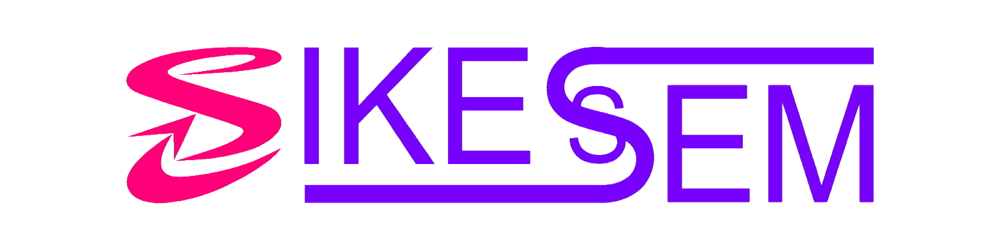

  <h1> SIGUI Kessé Emmanuel (SIKessEm)</h1>

***

## About SIKessEm

SIKessEm (real name SIGUI Kessé Emmanuel) is a web developer who enjoys discovering things on his own and learning and developing new solutions that advance technology.
Its open-source softwares are available at [https://oss.sikessem.com](https://oss.sikessem.com).

He is not very active on social networks but you can [contact him](https://sikessem.com/contact) or [follow him](https://sikessem.com/follow) from [his website](https://sikessem.com).

[Click here to learn more about SIKessEm](https://about.sikessem.com).

## Useful links

SIGUI Kessé Emmanuel ([https://sikessem.com/](https://sikessem.com/)) <[developer@sikessem.com](mailto:developer@sikessem.com)> | [GitLab](https://gitlab.com/SIKessEm) | [GitHub](https://github.com/SIKessEm) | [npm](https://npmjs.org/~sikessem) | [Composer - Packagist](https://packagist.org/packages/sikessem/) | [Twitter](https://twitter.com/SIKessEm_tweets)

## Security Reports

Please send any sensitive issue to [report@sikessem.com](mailto:report@sikessem.com). Thanks!

## SIKessEm Legal

Visit [https://legal.sikessem.com](https://legal.sikessem.com) to find out the legal conditions on the use of SIKessEm products and services.

***

  
SIKessEm  Copyright &#169; 2021  SIGUI Kessé Emmanuel

  

